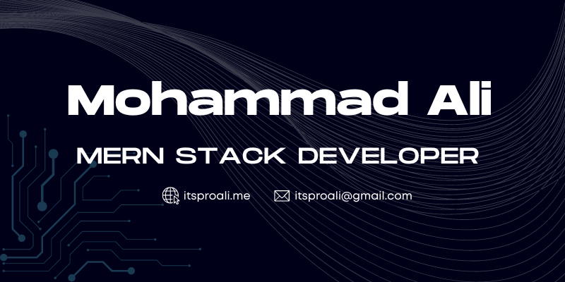

<!-- <h1 align="center">Hi 👋, I'm Mohammad Ali</h1> -->

 

 
 

 

## 👓 Here's some fun facts about me:

- ✨ I am a Full Stack Developer (MERN) with having 2+ years of experience.
- ⚡️ I am capable to solve working problems.
- 💫 Passionate about learning & development to reach the target.
- 🚀 My next mission is to become a Senior Software Engineer.
- 💥 I would love to build some Giant Website.
- 📫 I am also a student of Computer Science & Technology.
- 🌐 My portfolio: [Portfolio](https://itsproali.me/)
- 📝 Get Details about me: [Resume](https://drive.google.com/file/d/1qVQ1OLO-5RxHy1rwbe5Ib9igCTfeO99f/view?usp=sharing)
- 💬 Keep me in your touch : itsproali@gmail.com

    

## 👉 Connect with me:

    
    
    
    
    

 

## ✨ Technologies & Tools:

<!-- Front End -->

&nbsp;

&nbsp;

&nbsp;

&nbsp;

&nbsp;

&nbsp;

&nbsp;
 
 

<!-- Back End -->

&nbsp;

&nbsp;

&nbsp;

&nbsp;

&nbsp;

&nbsp;

 

<!-- Tools -->

&nbsp;

&nbsp;

&nbsp;

&nbsp;

&nbsp;

&nbsp;

&nbsp;

&nbsp;

 

## 🔥 Streak Stats

  
